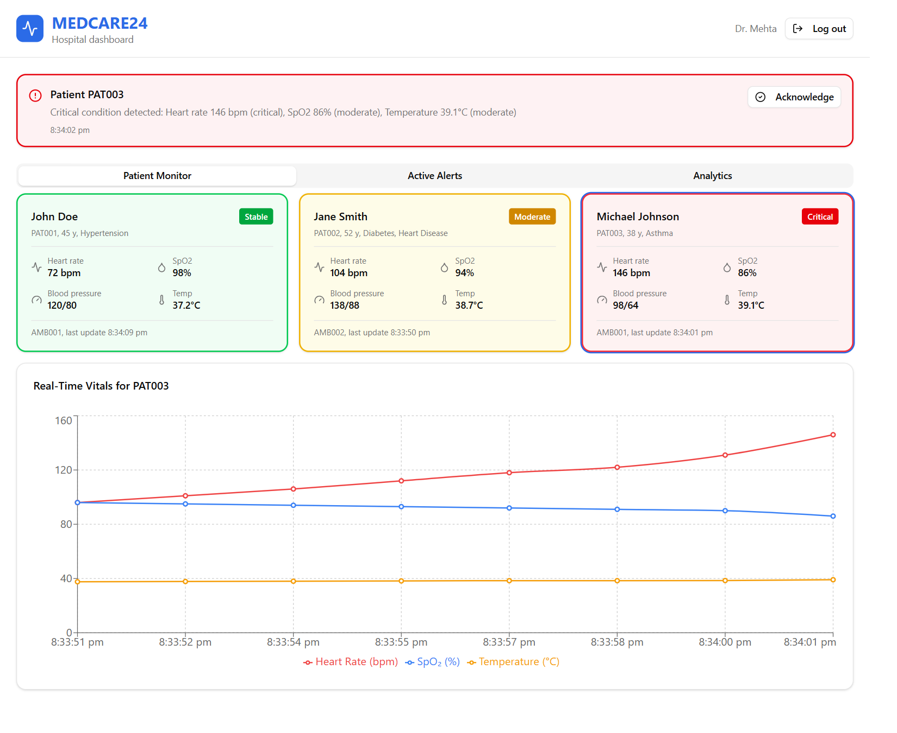
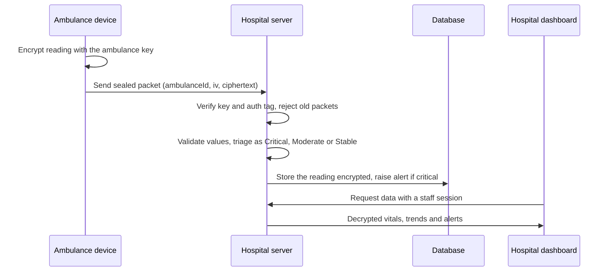
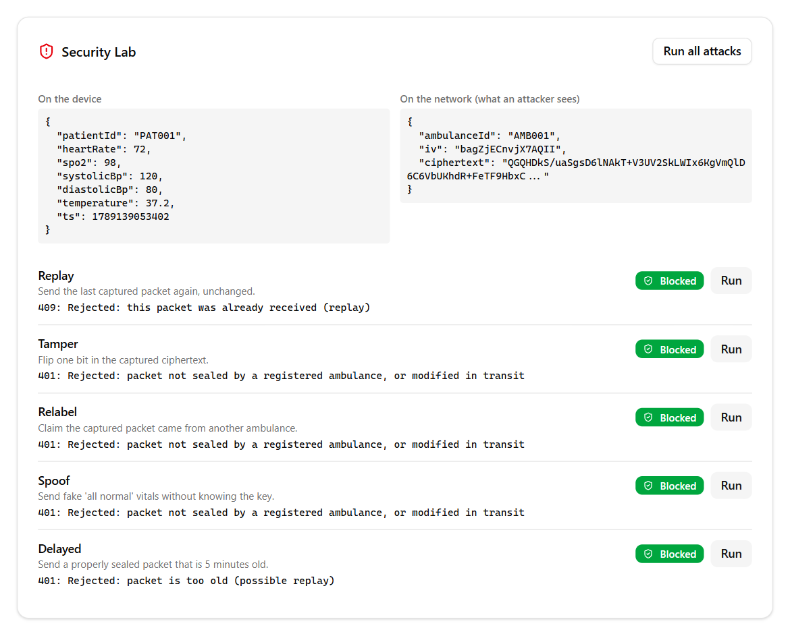

<h1 align="center">MEDCARE24</h1>

<p align="center">
  <b>Secure, real-time vitals from the ambulance to the hospital.</b><br>
  Encrypted on the device, verified by the server, live on the doctor's screen.
</p>

<p align="center">
  <a href="#recognition"></a>
  
  
  
  
  <a href="LICENSE"></a>
</p>


<p align="center"><i>The hospital dashboard: one patient is getting worse on the way in, and the team is alerted before arrival.</i></p>

## At a glance

- **What:** an ambulance streams a patient's vitals to the hospital while it is still on the road.
- **Why it matters:** the emergency team can prepare early, and nobody on the network can read, change or fake the data.
- **How:** every reading is encrypted with the ambulance's own key (AES-256-GCM), checked by the server, triaged and stored encrypted.
- **Proof:** a built-in Security Lab runs real attacks against the API and shows each one being rejected.

## The problem

In an emergency, the hospital usually learns about a patient's condition only when the ambulance reaches the door. Sending vitals ahead fixes that, but it creates a new risk. Health data travelling over mobile networks can be intercepted, and worse, altered. A single changed reading could make a critical patient look stable.

MEDCARE24 was built to solve both sides: get the data there early, and make sure it can be trusted when it arrives.

## How it works



1. **Ambulance.** The device encrypts each reading in the browser using the WebCrypto API. The ambulance ID is bound into the encryption, so a packet cannot be passed off as coming from another ambulance.
2. **Server.** A Next.js API route opens the packet with that ambulance's key. If the key is wrong or a single bit was changed, decryption fails. Packets older than 60 seconds are dropped, and each packet can only be stored once.
3. **Triage.** Heart rate, SpO2, blood pressure and temperature are checked for impossible values, then scored against triage thresholds. Critical readings create an alert.
4. **Hospital.** Staff sign in and see live patient cards, a trend chart per patient and alerts to acknowledge.

## Security design

| Threat | What stops it |
|---|---|
| Someone reads the traffic | Only ciphertext leaves the ambulance |
| A value is changed in transit | The AES-GCM authentication tag no longer matches |
| A fake ambulance sends data | Without the device key, no valid packet can be made |
| A captured packet is sent again | 60 second freshness window, plus a unique nonce per packet in the database |
| The database is leaked | Vitals and alert messages are stored encrypted with a separate storage key |
| Someone calls the hospital APIs | Every route needs a signed, httpOnly session cookie |

**Why encrypt when HTTPS already exists?** HTTPS protects data only while it moves. Here the data stays encrypted at rest in a third-party database, and the per-ambulance key proves *which* ambulance sent each reading, something HTTPS alone does not do.

You can test all of this yourself on the simulator page:


<p align="center"><i>The Security Lab attacks the real API. Every attack is rejected with a clear reason.</i></p>

## Tech stack

| Layer | Choice | Why |
|---|---|---|
| App and API | Next.js 16, React 19, TypeScript | One codebase for the UI and the backend routes |
| Styling | Tailwind CSS, shadcn/ui, Recharts | Fast to build, consistent components, simple charts |
| Database | PostgreSQL on Neon | Free serverless Postgres that works over HTTP |
| Encryption | WebCrypto (browser), Node `crypto` (server) | Built into the platform, no extra crypto libraries |
| Tests | Node built-in test runner | No test framework to install |

## Getting started

You need Node.js 20 or newer and a free [Neon](https://neon.tech) database.

```bash
git clone https://github.com/Swaraj-Mandre/cyber_security_hackathon.git
cd cyber_security_hackathon
npm install
npm run keys
```

Copy `.env.example` to `.env.local` and fill it in:

- `DATABASE_URL` from Neon (Dashboard, then Connect)
- the four lines printed by `npm run keys`
- any `DASHBOARD_PASSWORD` for hospital staff

Then create the tables and start the app:

```bash
npm run db:setup
npm run dev
```

Open [localhost:3000](http://localhost:3000).

**Two-minute demo**

1. Go to `/simulator`, paste `DEVICE_KEY_AMB001` from `.env.local` and start the simulation.
2. Open `/dashboard` in a second tab and sign in. Patient cards update every few seconds.
3. Send a reading with a heart rate of 150. A critical alert appears on the dashboard.
4. Back on the simulator, click **Run all attacks** in the Security Lab.

## Project structure

```
app/
  api/            API routes (transmit, auth, patients, vitals, alerts, health)
  dashboard/      hospital dashboard
  simulator/      ambulance simulator and Security Lab
  login/          staff sign-in
components/       dashboard and simulator UI
lib/
  ambulance-device.ts   encryption on the device (WebCrypto)
  encryption.ts         decryption and storage encryption on the server
  auth.ts               signed session cookies
  classification.ts     triage rules
  db.ts                 database queries
scripts/          database schema, setup and key generation
tests/            encryption and triage tests
```

<details>
<summary><b>API reference</b></summary>

| Method | Route | Access | Purpose |
|---|---|---|---|
| POST | `/api/vitals/transmit` | Ambulance | Receive a sealed packet |
| POST | `/api/auth/login` | Public | Staff sign-in, sets the session cookie |
| POST | `/api/auth/logout` | Staff | Clear the session |
| GET | `/api/auth/session` | Staff | Current staff member |
| GET | `/api/patients/with-vitals` | Staff | All patients with their latest reading |
| GET | `/api/vitals/patient/:id` | Staff | Recent readings for one patient |
| GET | `/api/alerts/active` | Staff | Unacknowledged alerts |
| POST | `/api/alerts/acknowledge` | Staff | Acknowledge an alert |
| GET | `/api/health` | Public | Shows which settings are missing, never their values |

</details>

## Tests

```bash
npm test
```

The tests encrypt a packet exactly as the browser does and open it with the server code. They check that a flipped bit, a wrong key and a changed ambulance ID are all rejected, that stored data round-trips, and that triage gives the expected result.

## Limitations and next steps

- Staff share one dashboard password. Individual accounts and roles would come next.
- Keys are symmetric, so the hospital holds each ambulance's key. Public-key signatures would remove that.
- The dashboard polls every few seconds. WebSockets or server-sent events would make it push-based.
- Triage thresholds are for demonstration and are not clinically validated. A standard score such as NEWS2, with respiratory rate, is the natural upgrade.

## Recognition

MEDCARE24 was built by **Team SAHARA** at the **Hackathon for Cyber Security**, a 24-hour event held at MIT Art, Design and Technology University, Pune, on 4 and 5 November 2025. The project won the **Healthcare track**.

## License

Released under the [MIT License](LICENSE).
